# 🗺 Глобальный каталог бизнес-функционала платформы (Feature Catalog)

> **Назначение:** Полный мастер-реестр реализованных бизнес-возможностей клиентской части образовательной платформы ED.Learn (Next.js 16, React 19, Zustand, Puck Editor, Axios).  
> **Целевая аудитория:** Продакт-менеджеры, системные и бизнес-аналитики, постановщики продуктовых задач и QA-инженеры.  
> **Дата актуализации:** 2026-10-04  

---

## 📑 Сводная матрица доменов и функциональных спецификаций

| Домен платформы | Описание бизнес-области | Ссылка на детальную спецификацию |
|---|---|---|
| **Сессия и профиль (Store)** | Управление жизненным циклом сессии пользователя, JWT-токенами, автоматическое определение роли (`student`/`teacher`) и сохранение контекста в браузере. | [frontend/src/store/FUNCTIONAL_SPEC.md](file:///c:/Users/gogol/OneDrive/Desktop/EdTech/frontend/src/store/FUNCTIONAL_SPEC.md) |
| **Ядро и контент (Lib)** | Axios HTTP-транспорт с прозрачным перехватом 401 и ротацией токенов; парсер интерактивных шаблонов пропусков `{Ответ; Дистракторы}`; декларативная схема 12 типов блоков Puck. | [frontend/src/lib/FUNCTIONAL_SPEC.md](file:///c:/Users/gogol/OneDrive/Desktop/EdTech/frontend/src/lib/FUNCTIONAL_SPEC.md) |
| **Общие UI-компоненты и плеер** | RBAC-защита маршрутов `ProtectedRoute`, адаптивный `Sidebar` с переключением ролей интерфейса, интерактивный плеер уроков `PuckLessonViewer` и модальные окна учителя. | [frontend/src/components/FUNCTIONAL_SPEC.md](file:///c:/Users/gogol/OneDrive/Desktop/EdTech/frontend/src/components/FUNCTIONAL_SPEC.md) |
| **Аутентификация (Auth)** | Формы входа и регистрации с автогенерацией никнеймов, клиентской валидацией, переключением видимости паролей и ролевой маршрутизацией. | [frontend/src/app/(auth)/FUNCTIONAL_SPEC.md](file:///c:/Users/gogol/OneDrive/Desktop/EdTech/frontend/src/app/%28auth%29/FUNCTIONAL_SPEC.md) |
| **Каталог и лендинг курсов** | Витрина курсов с поиском, фильтрами по уровню и языку, модальным окном видео-трейлера, быстрой записью на курс в 1 клик и детальной программой обучения. | [frontend/src/app/courses/FUNCTIONAL_SPEC.md](file:///c:/Users/gogol/OneDrive/Desktop/EdTech/frontend/src/app/courses/FUNCTIONAL_SPEC.md) |
| **Кабинет студента (Dashboard)** | Список изучаемых программ с прогресс-барами освоения, интерактивное дерево курса с индикацией завершения уроков и средним баллом, профиль и темы оформления. | [frontend/src/app/dashboard/FUNCTIONAL_SPEC.md](file:///c:/Users/gogol/OneDrive/Desktop/EdTech/frontend/src/app/dashboard/FUNCTIONAL_SPEC.md) |
| **Интерактивный урок (Lessons)** | Полноэкранный плеер прохождения урока, регистрация начала сессии (`/start`), сбор ответов на квизы и отправка эссе на сервер (`/complete`). | [frontend/src/app/lessons/FUNCTIONAL_SPEC.md](file:///c:/Users/gogol/OneDrive/Desktop/EdTech/frontend/src/app/lessons/FUNCTIONAL_SPEC.md) |
| **Кабинет преподавателя (Teacher)** | Мастер создания курса со слагом, конструктор учебного плана (секций и уроков) с реордерингом, визуальный конструктор Puck (Content-as-Data), аналитика и проверка ДЗ. | [frontend/src/app/teacher/FUNCTIONAL_SPEC.md](file:///c:/Users/gogol/OneDrive/Desktop/EdTech/frontend/src/app/teacher/FUNCTIONAL_SPEC.md) |
| **Файловое хранилище (Uploads)** | Одиночная и пакетная загрузка файлов (Word-картинки, обложки, ДЗ), проверка magic bytes, лимиты 25/50 МБ, раздача статики. | [internal/service/upload/FUNCTIONAL_SPEC.md](file:///c:/Users/gogol/OneDrive/Desktop/EdTech/internal/service/upload/FUNCTIONAL_SPEC.md) |
| **Тестирование и античит (Quiz)** | Конструирование тестов, защита попыток (Advisory Lock), античит-санитизация Puck JSON и серверный подсчет баллов. | [internal/service/quiz/FUNCTIONAL_SPEC.md](file:///c:/Users/gogol/OneDrive/Desktop/EdTech/internal/service/quiz/FUNCTIONAL_SPEC.md) |
| **Аутентификация и администрирование (Auth)** | Регистрация, JWT-авторизация, смена паролей, управление ролями/банами и административный реестр пользователей. | [internal/service/auth/FUNCTIONAL_SPEC.md](file:///c:/Users/gogol/OneDrive/Desktop/EdTech/internal/service/auth/FUNCTIONAL_SPEC.md) |

---

## 🏛 Реестр реализованных возможностей по доменам

### 1. Домен: Сессия и состояние пользователя (`frontend/src/store`)
* 📄 **Спецификация:** [store/FUNCTIONAL_SPEC.md](file:///c:/Users/gogol/OneDrive/Desktop/EdTech/frontend/src/store/FUNCTIONAL_SPEC.md)
* **Реализованный функционал:**
  * ✅ Инициализация и сохранение авторизационных JWT-ключей (`access_token`, `refresh_token`) в `localStorage`.
  * ✅ Безопасный логаут с полной очисткой учетных данных и сбросом режима интерфейса на `'student'`.
  * ✅ Автоопределение режима отображения: для ролей `teacher`, `author`, `admin` при входе автоматически включается режим интерфейса «Учитель».
  * ✅ Ручное переключение ViewMode (`student` ⇄ `teacher`) через боковую панель.
  * ✅ Мгновенное обновление профиля пользователя в локальном состоянии без перезагрузки страниц (`setUser`).

### 2. Домен: Сетевой транспорт и конфигурация Puck Editor (`frontend/src/lib`)
* 📄 **Спецификация:** [lib/FUNCTIONAL_SPEC.md](file:///c:/Users/gogol/OneDrive/Desktop/EdTech/frontend/src/lib/FUNCTIONAL_SPEC.md)
* **Реализованный функционал:**
  * ✅ Автоматическая подстановка `Authorization: Bearer <token>` во все HTTP-запросы.
  * ✅ Прозрачная обработка ошибки 401: фоновое обновление токена через `POST /auth/refresh` и повтор оригинального запроса без прерывания пользовательского процесса.
  * ✅ Защита от бесконечного цикла рефреша и аварийный сброс авторизации с перенаправлением на `/login`.
  * ✅ DSL-парсер интерактивных шаблонов пропусков `{Правильный; Ошибка1, Ошибка2}` для быстрого составления квизов авторами.
  * ✅ Декларативная регистрация 12 типов блоков Puck (теория, Word WYSIWYG, видео, 8 типов тестов, загрузка домашних заданий).

### 3. Домен: Общие интерфейсные компоненты (`frontend/src/components`)
* 📄 **Спецификация:** [components/FUNCTIONAL_SPEC.md](file:///c:/Users/gogol/OneDrive/Desktop/EdTech/frontend/src/components/FUNCTIONAL_SPEC.md)
* **Реализованный функционал:**
  * ✅ Ролевой барьер `ProtectedRoute`: проверка JWT, гидратация профиля, редирект гостей и экран 403 «Доступ запрещен».
  * ✅ Боковое меню `Sidebar`: адаптивное сворачивание (80px / 256px), динамические ссылки для студента/преподавателя, диалог подтверждения выхода.
  * ✅ Верхняя панель `TopNavbar`: навигация «Назад», заголовки и тумблер смены темы (светлая/темная).
  * ✅ Интерактивный плеер `PuckLessonViewer`: решение 8 типов контрольных заданий, мгновенная проверка ответов с подсветкой и комментариями автора, расчет баллов в процентах, модальное окно итогов урока.
  * ✅ Инлайн-редактор контента Puck `InlineEditable`: прямое редактирование текста на канвасе и текстовый процессор Word-типа.
  * ✅ Модальные окна преподавателя: создание/редактирование модулей, уроков, ручное зачисление студентов по Email/ID, детальная успеваемость студента (Drilldown) и оценка домашних заданий с обратной связью.

### 4. Домен: Авторизация и регистрация (`frontend/src/app/(auth)`)
* 📄 **Спецификация:** [(auth)/FUNCTIONAL_SPEC.md](file:///c:/Users/gogol/OneDrive/Desktop/EdTech/frontend/src/app/%28auth%29/FUNCTIONAL_SPEC.md)
* **Реализованный функционал:**
  * ✅ Экран входа `/login`: валидация email и пароля, обработка сетевых сбоев, умный редирект (учитель ➔ `/teacher/courses`, студент ➔ `/dashboard`).
  * ✅ Экран регистрации `/register`: проверка согласия с условиями сервиса, автогенерация никнейма, создание аккаунта и бесшовный автоматический вход.
  * ✅ Переключение видимости символов пароля («глаз»).

### 5. Домен: Каталог и витрина курсов (`frontend/src/app/courses`)
* 📄 **Спецификация:** [courses/FUNCTIONAL_SPEC.md](file:///c:/Users/gogol/OneDrive/Desktop/EdTech/frontend/src/app/courses/FUNCTIONAL_SPEC.md)
* **Реализованный функционал:**
  * ✅ Полнотекстовый поиск курсов с дебаунсом 250 мс.
  * ✅ Фильтрация курсов по уровню сложности (начальный, средний, продвинутый), языку и сортировка (дата, популярность).
  * ✅ Индикация статуса «Вы записаны» на карточках витрины на основе сопоставления с `/courses/my`.
  * ✅ Быстрая запись на курс в один клик без перехода на страницу лендинга.
  * ✅ Модальный просмотр промо-видеоролика курса.
  * ✅ Универсальная страница курса `/courses/[slug]`: поддержка строковых слагов и числовых ID, просмотр полного учебного плана и контекстное действие («Записаться» или «Продолжить обучение»).
  * ✅ Публичный профиль автора курса: обогащение данных курса объектом `author` (ID, имя, аватар, headline, bio, количество созданных курсов и общее число студентов) на лендинге курса без необходимости авторизации.

### 6. Домен: Кабинет студента (`frontend/src/app/dashboard`)
* 📄 **Спецификация:** [dashboard/FUNCTIONAL_SPEC.md](file:///c:/Users/gogol/OneDrive/Desktop/EdTech/frontend/src/app/dashboard/FUNCTIONAL_SPEC.md)
* **Реализованный функционал:**
  * ✅ Главная панель `/dashboard`: карточки начатых курсов и empty-state с приглашением в каталог.
  * ✅ Раздел «Мои курсы» `/dashboard/courses`: прогресс-бары освоения программ в процентах, количество пройденных уроков и средний балл.
  * ✅ Учебный кабинет курса `/dashboard/courses/[id]`: интерактивный аккордеон модулей, статус завершения уроков (✓), бейджи типов занятий, вычисление среднего балла за тесты курса и кнопка быстрого перехода к следующему непройденному уроку.
  * ✅ Настройки профиля `/dashboard/settings`: редактирование имени, фамилии, биографии, специализации/регалий (`headline` до 150 символов), аватара и выбор цветовой темы приложения.

### 7. Домен: Интерактивный плеер урока (`frontend/src/app/lessons`)
* 📄 **Спецификация:** [lessons/FUNCTIONAL_SPEC.md](file:///c:/Users/gogol/OneDrive/Desktop/EdTech/frontend/src/app/lessons/FUNCTIONAL_SPEC.md)
* **Реализованный функционал:**
  * ✅ Фоновая фиксация начала занятия: вызов `POST /lessons/{id}/start`.
  * ✅ Полноэкранный просмотр лекций, видеоматериалов и интерактивных тестов.
  * ✅ Отправка результатов урока: вызов `POST /lessons/{id}/complete` с передачей набранных баллов и собранных текстов эссе для проверки преподавателем.
  * ✅ Удобный возврат к учебному плану программы курса.
  * ✅ Бесшовная навигация между уроками (`GET /api/v1/lessons/{id}/navigation`): вычисление следующего (`next_lesson`) и предыдущего (`prev_lesson`) урока со сквозным переходом между секциями курса, а также выпадающее оглавление (Syllabus) с отметками завершения и баллами.

### 8. Домен: Кабинет преподавателя и конструктор уроков (`frontend/src/app/teacher`)
* 📄 **Спецификация:** [teacher/FUNCTIONAL_SPEC.md](file:///c:/Users/gogol/OneDrive/Desktop/EdTech/frontend/src/app/teacher/FUNCTIONAL_SPEC.md)
* **Реализованный функционал:**
  * ✅ Авторская студия `/teacher/courses`: реестр курсов со статусами («Опубликован»/«Черновик») и счетчиками уроков/студентов.
  * ✅ Мастер создания курса `/teacher/courses/new`: транслитерация названия в URL-слаг, настройка обложки, видео, уровня сложности и мгновенный переход к учебному плану.
  * ✅ Управление учебным планом `/teacher/courses/[id]/curriculum`: создание/редактирование/удаление модулей и уроков, изменение их порядка стрелками reorder.
  * ✅ Публикация курса в один клик (`POST /courses/{id}/publish` / перевод в черновик).
  * ✅ Аналитическая сводка курса: число студентов, средний прогресс, средний балл и счетчик ожидающих проверки работ.
  * ✅ Таблица студентов: ручное зачисление (`ModalAddStudent`), просмотр персонального отчета (`ModalStudentDrilldown`).
  * ✅ Очередь домашних заданий `/teacher/grading`: кросс-курсовая серверная агрегация непроверенных заданий (`GET /api/v1/teacher/grading/pending`) со сводкой счетчиков по курсам автора (`courses_summary`), фильтрацией по курсу, просмотром сданных студентами ответов и файлов, выставлением баллов с серверной валидацией диапазона `[0, maxPoints]` и текстовой обратной связи (`ModalGradeHW`).
  * ✅ Экспорт ведомости успеваемости в CSV (`GET /api/v1/courses/{id}/analytics/export`): формирование официальной ведомости успеваемости с кодировкой UTF-8 BOM для безупречного открытия в MS Excel, разделителем `;`, прогрессом, пройденными уроками, средним баллом, статусом и кодом сертификата.
  * ✅ Визуальный конструктор уроков `/teacher/lessons/[id]/edit`: интеграция Puck Editor в режиме Content-as-Data с инлайн-редактированием, деревом блоков `CustomOutline`, серверной валидацией схемы Puck JSON (до 5 МБ, 50+ тестов), защитой от дублирования ID блоков и сохранением структуры через `PATCH /lessons/{id}`.

---

## 🎯 Сквозные пользовательские сценарии (End-to-End Use Cases)

```mermaid
flowchart TD
    subgraph UC1["Сценарий 1: Регистрация и выбор роли"]
        A1["Гость заходит на /register"] --> A2["Вводит email, пароль, имя"]
        A2 --> A3["POST /auth/register + POST /auth/login"]
        A3 --> A4["useAuth.login() + fetchUser()"]
        A4 --> A5{"Роль пользователя"}
        A5 -->|"student"| A6["Редирект на /dashboard"]
        A5 -->|"teacher / author"| A7["Редирект на /teacher/courses"]
    end

    subgraph UC2["Сценарий 2: Обучение студента с квизами"]
        B1["Студент выбирает курс в /courses"] --> B2["Запись POST /courses/{id}/enroll"]
        B2 --> B3["Переход в /dashboard/courses/{id}"]
        B3 --> B4["Выбор урока /lessons/{id}"]
        B4 --> B5["POST /lessons/{id}/start"]
        B5 --> B6["Решение 8 типов квизов в PuckLessonViewer"]
        B6 --> B7["POST /lessons/{id}/complete (баллы + эссе)"]
        B7 --> B8["Обновление прогресса и возврат в курс"]
    end

    subgraph UC3["Сценарий 3: Создание курса и интерактивного урока"]
        C1["Преподаватель: /teacher/courses/new"] --> C2["POST /courses (slug, обложка)"]
        C2 --> C3["Конструктор /teacher/courses/{id}/curriculum"]
        C3 --> C4["Добавление модулей и уроков (модалки)"]
        C4 --> C5["Клик 'Редактировать контент'"]
        C5 --> C6["Полноэкранный Puck Editor /lessons/{id}/edit"]
        C6 --> C7["Добавление теории, видео, тестов (InlineEditable)"]
        C7 --> C8["Сохранение PATCH /lessons/{id} (JSON Data)"]
        C8 --> C9["Публикация курса: POST /courses/{id}/publish"]
    end

    subgraph UC4["Сценарий 4: Проверка домашних заданий учителем"]
        D1["Учитель открывает /teacher/grading"] --> D2["Выбор курса и фильтрация очереди"]
        D2 --> D3["Просмотр эссе и прикрепленных файлов"]
        D3 --> D4["Открытие ModalGradeHW"]
        D4 --> D5["Ввод баллов и комментария (feedback)"]
        D5 --> D6["POST /attempts/.../grade"]
        D6 --> D7["Уведомление и обновление очереди"]
    end
```

### 1. Сценарий: Регистрация пользователя и адаптация роли
1. **Регистрация:** Пользователь заполняет форму на странице [`/register`](file:///c:/Users/gogol/OneDrive/Desktop/EdTech/frontend/src/app/%28auth%29/register/page.tsx). При отсутствии введенного имени пользователя никнейм автоматически генерируется из Email ([`register/page.tsx#L45`](file:///c:/Users/gogol/OneDrive/Desktop/EdTech/frontend/src/app/%28auth%29/register/page.tsx#L45)).
2. **Бесшовный вход:** После создания учетной записи клиент автоматически выполняет авторизацию через `POST /auth/login` ([`register/page.tsx#L49`](file:///c:/Users/gogol/OneDrive/Desktop/EdTech/frontend/src/app/%28auth%29/register/page.tsx#L49)).
3. **Сохранение сессии:** Метод стора `login()` сохраняет ключи в `localStorage` и запрашивает профиль через `fetchUser()` ([`useAuth.ts#L39-L44`](file:///c:/Users/gogol/OneDrive/Desktop/EdTech/frontend/src/store/useAuth.ts#L39-L44)).
4. **Ролевой выбор интерфейса:** Если у пользователя роль преподавателя (`teacher`, `author`, `admin`), он направляется в [`/teacher/courses`](file:///c:/Users/gogol/OneDrive/Desktop/EdTech/frontend/src/app/teacher/courses/page.tsx); обычный учащийся перенаправляется в [`/dashboard`](file:///c:/Users/gogol/OneDrive/Desktop/EdTech/frontend/src/app/dashboard/page.tsx). При наличии прав пользователь может переключать режим просмотра прямо в боковом меню через `handleRoleChange` ([`Sidebar.tsx#L30-L37`](file:///c:/Users/gogol/OneDrive/Desktop/EdTech/frontend/src/components/layout/Sidebar.tsx#L30-L37)).

---

### 2. Сценарий: Выбор курса и интерактивное обучение с тестированием
1. **Поиск курса в каталоге:** Студент открывает [`/courses`](file:///c:/Users/gogol/OneDrive/Desktop/EdTech/frontend/src/app/courses/page.tsx), находит нужный курс с помощью поиска с дебаунсом 250 мс и фильтров сложности ([`courses/page.tsx#L67-L96`](file:///c:/Users/gogol/OneDrive/Desktop/EdTech/frontend/src/app/courses/page.tsx#L67-L96)).
2. **Запись на курс:** Студент нажимает «Записаться на курс» в карточке каталога ([`courses/page.tsx#L105-L120`](file:///c:/Users/gogol/OneDrive/Desktop/EdTech/frontend/src/app/courses/page.tsx#L105-L120)) или на лендинге курса ([`courses/[slug]/page.tsx#L69-L81`](file:///c:/Users/gogol/OneDrive/Desktop/EdTech/frontend/src/app/courses/%5Bslug%5D/page.tsx#L69-L81)), инициируя запрос `POST /courses/{id}/enroll`.
3. **Начало обучения:** Студент попадает в навигатор по курсу [`/dashboard/courses/{id}`](file:///c:/Users/gogol/OneDrive/Desktop/EdTech/frontend/src/app/dashboard/courses/%5Bid%5D/page.tsx), где видит структуру модулей, процент освоения и кнопку «Продолжить обучение» к первому непройденному уроку.
4. **Прохождение урока:** На странице [`/lessons/{id}`](file:///c:/Users/gogol/OneDrive/Desktop/EdTech/frontend/src/app/lessons/%5Bid%5D/page.tsx) бэкенд уведомляется о старте (`POST /lessons/{id}/start`). Клиент загружает JSON-контент Puck и передает его в интерактивный плеер [`PuckLessonViewer`](file:///c:/Users/gogol/OneDrive/Desktop/EdTech/frontend/src/components/player/PuckLessonViewer.tsx#L39-L1007).
5. **Решение заданий:** Студент решает задания 8 типов (одиночный выбор, множественный выбор, сопоставление пар, выпадающие пропуски, текстовые пропуски, сортировка шагов, открытое эссе, загрузка файла).
6. **Завершение урока:** Клик по кнопке завершения рассчитывает итоговый балл, отправляет результаты через `POST /lessons/{id}/complete` ([`lessons/[id]/page.tsx#L42-L54`](file:///c:/Users/gogol/OneDrive/Desktop/EdTech/frontend/src/app/lessons/%5Bid%5D/page.tsx#L42-L54)), фиксирует оценку и возвращает студента к программе курса.

---

### 3. Сценарий: Создание курса и визуальное конструирование интерактивного урока
1. **Создание курса:** Преподаватель открывает [`/teacher/courses/new`](file:///c:/Users/gogol/OneDrive/Desktop/EdTech/frontend/src/app/teacher/courses/new/page.tsx), указывает название (автоматически формируется URL-слаг), описание, обложку и нажимает «Создать курс» (`POST /courses`).
2. **Формирование программы курса:** Преподаватель перенаправляется в конструктор учебного плана [`/teacher/courses/{id}/curriculum`](file:///c:/Users/gogol/OneDrive/Desktop/EdTech/frontend/src/app/teacher/courses/%5Bid%5D/curriculum/page.tsx):
   - Открывает модалку `ModalCreateModule` и создает разделы ([`ModalCreateModule.tsx#L15-L64`](file:///c:/Users/gogol/OneDrive/Desktop/EdTech/frontend/src/components/teacher/ModalCreateModule.tsx#L15-L64)).
   - Внутри разделов создает уроки через `ModalCreateLesson` ([`ModalCreateLesson.tsx#L17-L61`](file:///c:/Users/gogol/OneDrive/Desktop/EdTech/frontend/src/components/teacher/ModalCreateLesson.tsx#L17-L61)).
   - При необходимости меняет порядок тем кнопками реордеринга ([`curriculum/page.tsx#L159-L195`](file:///c:/Users/gogol/OneDrive/Desktop/EdTech/frontend/src/app/teacher/courses/%5Bid%5D/curriculum/page.tsx#L159-L195)).
3. **Визуальная сборка урока в Puck:** Преподаватель нажимает «Редактировать контент в Puck» у выбранного урока и переходит в полноэкранный редактор [`/teacher/lessons/{id}/edit`](file:///c:/Users/gogol/OneDrive/Desktop/EdTech/frontend/src/app/teacher/lessons/%5Bid%5D/edit/page.tsx):
   - Перетаскивает на холст блоки: заголовки, лекцию с WYSIWYG Word-редактором, видеоролик YouTube, контрольные тесты.
   - Редактирует текст вопросов и правильные варианты прямо на канвасе благодаря `InlineEditable` ([`InlineEditable.tsx#L43-L120`](file:///c:/Users/gogol/OneDrive/Desktop/EdTech/frontend/src/components/editor/InlineEditable.tsx#L43-L120)).
   - Нажимает «Опубликовать / Сохранить», сохраняя JSON-дерево в базу через `PATCH /lessons/{id}` ([`edit/page.tsx#L49-L60`](file:///c:/Users/gogol/OneDrive/Desktop/EdTech/frontend/src/app/teacher/lessons/%5Bid%5D/edit/page.tsx#L49-L60)).
4. **Публикация курса:** Вернувшись в программу курса, преподаватель нажимает кнопку «Опубликовать курс», открывая доступ студентам (`POST /courses/{id}/publish`) ([`curriculum/page.tsx#L136-L157`](file:///c:/Users/gogol/OneDrive/Desktop/EdTech/frontend/src/app/teacher/courses/%5Bid%5D/curriculum/page.tsx#L136-L157)).

---

### 4. Сценарий: Проверка домашних заданий и выставление оценок
1. **Просмотр очереди на проверку:** Преподаватель переходит в раздел [`/teacher/grading`](file:///c:/Users/gogol/OneDrive/Desktop/EdTech/frontend/src/app/teacher/grading/page.tsx) или на вкладку студентов курса [`/teacher/courses/{id}/curriculum?tab=students`](file:///c:/Users/gogol/OneDrive/Desktop/EdTech/frontend/src/app/teacher/courses/%5Bid%5D/curriculum/page.tsx#L43).
2. **Фильтрация заданий:** Выбирает целевой курс и видит список работ, ожидающих ручной проверки ([`PendingHomeworksQueue.tsx`](file:///c:/Users/gogol/OneDrive/Desktop/EdTech/frontend/src/components/teacher/PendingHomeworksQueue.tsx)).
3. **Грейдинг работы:** Нажимает «Проверить и оценить», открывая модальное окно [`ModalGradeHW`](file:///c:/Users/gogol/OneDrive/Desktop/EdTech/frontend/src/components/teacher/ModalGradeHW.tsx#L14-L42):
   - Изучает вопрос задания и развернутый ответ студента (или ссылку на прикрепленный файл).
   - Выставляет заработанный балл (до максимального лимита задания).
   - Пишет комментарий преподавателя (Feedback).
   - Отправляет оценку через `POST /quizzes/attempts/{attId}/answers/{ansId}/grade`.
4. **Обновление успеваемости:** Очередь немедленно обновляется, а средний балл и прогресс студента пересчитываются и становятся видны в его кабинете и в карточке аналитики курса.

---

### 9. Домен: Файловое хранилище и загрузка файлов (`internal/service/upload`)
* 📄 **Спецификация:** [internal/service/upload/FUNCTIONAL_SPEC.md](file:///c:/Users/gogol/OneDrive/Desktop/EdTech/internal/service/upload/FUNCTIONAL_SPEC.md)
* **Реализованный функционал:**
  * ✅ Загрузка бинарных файлов через HTTP multipart-форму `POST /api/v1/upload`.
  * ✅ Авторизация загрузки по Bearer JWT токену.
  * ✅ Строгая валидация типов файлов по сигнатуре (magic bytes) и черному списку исполняемых файлов (.exe, .sh, .php, .js и др.).
  * ✅ Ограничение максимального размера файла (до 25 МБ для общих файлов и до 50 МБ для категории `presentation`).
  * ✅ Поддержка загрузки слайдовых PDF-презентаций (`category = presentation`) с валидацией расширения `.pdf` и MIME `application/pdf`.
  * ✅ Безопасная генерация путей на базе UUID v4 по категориям (`avatar`, `course_cover`, `homework`, `general`, `lesson_media`, `presentation`) и датам.
  * ✅ Статическая отдача сохраненных файлов по публичным URL `/static/uploads/...` и `/static/...`.
  * ✅ Потоковая отдача PDF через `StaticFileServer`: заголовки `Content-Disposition: inline; filename="presentation.pdf"`, `Accept-Ranges: bytes` и поддержка частичных HTTP Range-запросов (`206 Partial Content`) для встроенного браузерного плеера без принудительного скачивания.
  * ✅ Пакетная загрузка встроенных изображений из Word-документов (`POST /api/v1/upload/batch`) с лимитом до 50 файлов и 50 МБ, параллельным сохранением через горутины и возвратом постоянных URL для устранения Base64-раздувания уроков.

---

### 10. Домен: Отзывы и рейтинги курсов (`internal/service/review`)
* 📄 **Спецификация:** [internal/service/review/FUNCTIONAL_SPEC.md](file:///c:/Users/gogol/OneDrive/Desktop/EdTech/internal/service/review/FUNCTIONAL_SPEC.md)
* **Реализованный функционал:**
  * ✅ Оценка курса от 1 до 5 звезд с опциональным текстовым комментарием (`POST /api/v1/courses/{courseid}/reviews`).
  * ✅ Защита от накруток рейтинга: оценивать могут только зачисленные студенты (`enrolledRepo.UserExistCourse`) с прогрессом по курсу не менее 30% (`progressRepo.GetCourseProgress` $\ge 30\%$).
  * ✅ Уникальность отзыва: один отзыв на одного студента на курс (Upsert-семантика: повторная отправка обновляет существующий отзыв).
  * ✅ Транзакционный автоматический пересчет агрегатов: средний рейтинг (`NUMERIC(3,2)`) и количество отзывов (`reviews_count`) синхронизируются в таблице `courses`.
  * ✅ Удаление отзыва студентом с каскадным пересчетом общего рейтинга курса (`DELETE /api/v1/courses/{courseid}/reviews`).
  * ✅ Получение своего отзыва (`GET /api/v1/courses/{courseid}/reviews/my`).
  * ✅ Публичный пагинированный каталог отзывов с детализацией распределения оценок 1–5 звезд (`GET /api/v1/courses/{courseid}/reviews`).

---

### 11. Домен: Сертификаты об окончании курсов (`internal/service/certificate`)
* 📄 **Спецификация:** [internal/service/certificate/FUNCTIONAL_SPEC.md](file:///c:/Users/gogol/OneDrive/Desktop/EdTech/internal/service/certificate/FUNCTIONAL_SPEC.md)
* **Реализованный функционал:**
  * ✅ Автоматическая выдача официального электронного сертификата при достижении 100% прогресса (`GET /api/v1/courses/{courseid}/certificate`).
  * ✅ Защита от преждевременного выпуска: обязательная проверка `Percent == 100` и прохождения всех уроков курса (`CompletedLess == TotalLessons`).
  * ✅ Идемпотентность выдачи: повторный запрос возвращает существующий сертификат без создания дубликатов.
  * ✅ Неизменяемый снимок данных (Snapshotting): фиксация имени/фамилии студента (`StudentName`), названия курса (`CourseTitle`) и итогового среднего балла (`FinalScore`).
  * ✅ Генерация защищенного криптографического кода формата `EDL-YYYY-XXXXXXXX` через `crypto/rand`.
  * ✅ Публичная проверка валидности сертификата по коду без авторизации (`GET /api/v1/certificates/verify/{code}`).

---

### 12. Домен: Внутрисистемные уведомления (`internal/service/notification`)
* 📄 **Спецификация:** [internal/service/notification/FUNCTIONAL_SPEC.md](file:///c:/Users/gogol/OneDrive/Desktop/EdTech/internal/service/notification/FUNCTIONAL_SPEC.md)
* **Реализованный функционал:**
  * ✅ Центр пользовательских уведомлений (In-App Notification Center).
  * ✅ Получение ленты последних событий с подсчетом количества непрочитанных (`GET /api/v1/notifications`).
  * ✅ Пометка отдельного уведомления как прочитанного (`PATCH /api/v1/notifications/{id}/read`) с защитой от чужих ID (`ErrNotificationNotFound`).
  * ✅ Пакетная пометка всех уведомлений пользователя прочитанными (`POST /api/v1/notifications/read-all`).
  * ✅ Событийная интеграция при выставлении преподавателем оценки за домашнее задание (`GradeAttemptAnswer`): генерация персонализированного уведомления студенту с оценкой и ссылкой на урок.

---

### 13. Домен: Аутентификация и администрирование пользователей (`internal/service/auth`)
* 📄 **Спецификация:** [internal/service/auth/FUNCTIONAL_SPEC.md](file:///c:/Users/gogol/OneDrive/Desktop/EdTech/internal/service/auth/FUNCTIONAL_SPEC.md)
* **Реализованный функционал:**
  * ✅ Регистрация пользователей с валидацией уникальности (`POST /api/v1/auth/register`).
  * ✅ Вход и выпуск Access/Refresh пары токенов (`POST /api/v1/auth/login`).
  * ✅ Ротация Refresh-токенов с защитой от кражи (`POST /api/v1/auth/refresh`).
  * ✅ Завершение сеанса (`POST /api/v1/auth/logout`).
  * ✅ Получение и обновление профиля (`GET /api/v1/auth/me`, `PATCH /api/v1/auth/profile`).
  * ✅ Безопасная смена пароля с проверкой старого и отзывом всех сессий (`POST /api/v1/auth/change-password`).
  * ✅ Синхронизация пользовательских предпочтений доступности и комфортного чтения (`font_scale`, `content_width`, `line_height`, `reading_theme`) с неразрушающим shallow merge (`PATCH /api/v1/auth/preferences`, `GET /api/v1/auth/me`).
  * ✅ Административное управление ролями пользователей (`PATCH /api/v1/admin/users/{id}/role`).
  * ✅ Административная блокировка/разблокировка пользователей с моментальным отзывом сессий (`PATCH /api/v1/admin/users/{id}/ban`).
  * ✅ Административный просмотр реестра пользователей с фильтрацией (роль, статус бана, поиск по email/имени) и пагинацией (`GET /api/v1/admin/users`).

---

### 14. Домен: Целостность оценивания и прогресс (Anti-Cheat & Scoring Guard) (`internal/service/progress`)
* 📄 **Спецификация:** [internal/service/progress/FUNCTIONAL_SPEC.md](file:///c:/Users/gogol/OneDrive/Desktop/EdTech/internal/service/progress/FUNCTIONAL_SPEC.md)
* **Реализованный функционал:**
  * ✅ Защита от накрутки автоматических 100 баллов при завершении проверочных тестов (`POST /api/v1/lessons/{id}/complete`).
  * ✅ Серверный расчет оценки строго на основе правильности ответов на интерактивные блоки (Puck JSON) или верифицированной попытки (`quiz_attempts`).
  * ✅ Обработка досрочного завершения тестирования (`is_abandoned: true`): пропущенные вопросы оцениваются в 0 баллов с фиксацией реального процента.
  * ✅ Стратегия Best Score Preservation: сохранение высшего балла в прогрессе урока при повторных попытках (слабые или заброшенные попытки не снижают оценку).
  * ✅ Защита статуса завершенности: заброшенная или неудачная попытка не сбрасывает статус ранее успешно завершенного урока.
  * ✅ Pre-flight API истории попыток (`GET /api/v1/lessons/{id}/attempts/summary`): общее число попыток, лимит, возможность начать новую попытку, лучший результат и хронологическая история с таймстемпами.
  * ✅ Старт новой попытки тестирования (`POST /api/v1/lessons/{id}/attempts/start`) с валидацией лимита попыток (`403 Forbidden` при исчерпании).
  * ✅ Безусловное завершение лекционных материалов без тестов со 100% прогрессом.
  * ✅ Гибкие правила тестирования `quiz_settings`: общий таймер (`time_limit_minutes`), блиц-таймер (`question_time_limit_seconds`), лимит попыток (`max_attempts`), проходной порог (`passing_score_percent`), перемешивание (`shuffle_questions`) и режим скрытия ответов (`feedback_mode`).
  * ✅ Серверная валидация времени прохождения теста с Grace Period 15 секунд: отклонение запоздалых ответов и завершение попытки по таймауту (`status: timed_out`, `is_passed: false`, `score: 0`).
  * ✅ Экзаменационный режим `exam_blind`: полное скрытие правильных ответов и пояснений (`results: nil`) в ответах сервера.
  * ✅ Кастомный проходной порог `passing_score_percent`: урок помечается как `completed` только при преодолении установленного процента.
  * ✅ Фоновое автосохранение черновика ответов (`PATCH /api/v1/lessons/{id}/attempts/{attempt_id}/draft`): сохранение `draft_answers JSONB` и текущего шага `current_step` с защитой от перезаписи сданных попыток и просроченных дедлайнов.
  * ✅ Восстановление активной сессии тестирования (`GET /api/v1/lessons/{id}/attempts/active`): возврат сохраненного драфта, текущего шага, точного расчет оставшихся секунд `remaining_seconds` от серверного времени и автозакрытие истекших попыток.

---

### 15. Домен: Тестирование, проверка знаний и домашние задания (`internal/service/quiz`)
* 📄 **Спецификация:** [internal/service/quiz/FUNCTIONAL_SPEC.md](file:///c:/Users/gogol/OneDrive/Desktop/EdTech/internal/service/quiz/FUNCTIONAL_SPEC.md)
* **Реализованный функционал:**
  * ✅ Создание квизов и вопросов (`POST /api/v1/lessons/{lesson_id}/quizzes`).
  * ✅ Старт попытки тестирования с защитой от race condition через PostgreSQL Advisory Lock (`POST /api/v1/quizzes/{quiz_id}/attempts/start`).
  * ✅ Сдача попытки с автоскорингом закрытых тестов и изоляцией открытых эссе (`POST /api/v1/quizzes/attempts/{attempt_id}/submit`).
  * ✅ Ручная проверка и рецензирование развернутых ответов преподавателем (`POST /api/v1/quizzes/attempts/{attempt_id}/answers/{answer_id}/grade`) с автозавершением урока при успехе и отправкой нотификации.
  * ✅ API получения результатов проверки и рецензии домашнего задания для студента (`GET /api/v1/lessons/{id}/homework-feedback`): статус сдачи (`not_submitted`, `pending`, `graded`), карточка проверившего преподавателя, баллы, максимальные баллы и текстовая рецензия.

